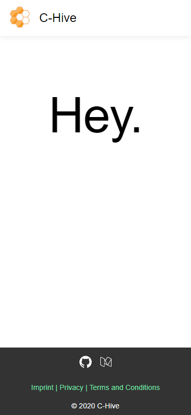
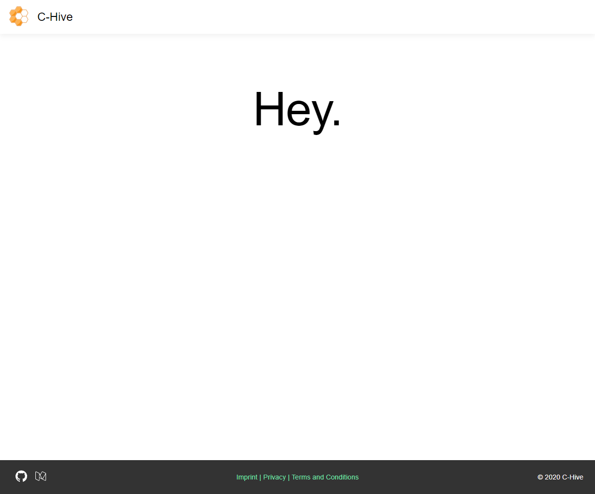

# Create React App TypeScript Starter

#### Opinionated Create React App boilerplate in TypeScript for rapid development with battle-tested standards.

Check out Live: https://thisismydesign.github.io/cra-typescript-starter/

[Use this template](https://github.com/thisismydesign/cra-typescript-starter/generate)

## Stack

It has
- everything from [js-boilerplate](https://github.com/c-hive/js-boilerplate)
- everything from [cra-boilerplate](https://github.com/c-hive/cra-boilerplate)
- everything from [cra-typescript-boilerplate](https://github.com/c-hive/cra-typescript-boilerplate)
- Material UI
- styled-components
- cypress
- Responsive Layout component with header and footer
- Configurable color palette
- React router
- Code splitting
- Helmet
- Google Analytics

## Conventions

This project follows [C-Hive guides](https://github.com/c-hive/guides) for code style, way of working and other development concerns.

## License

The project is available as open source under the terms of the [MIT License](http://opensource.org/licenses/MIT).
